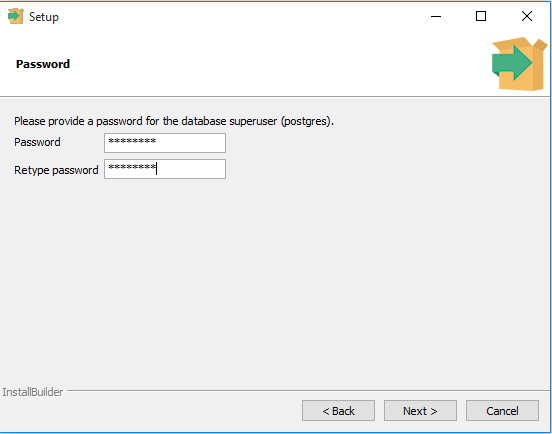
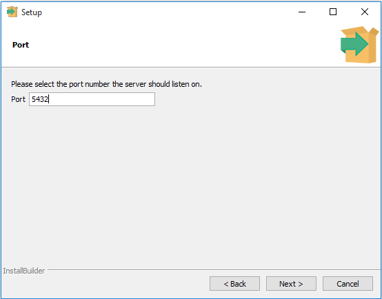
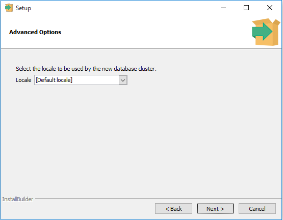
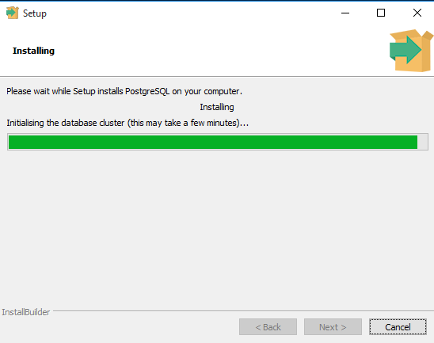
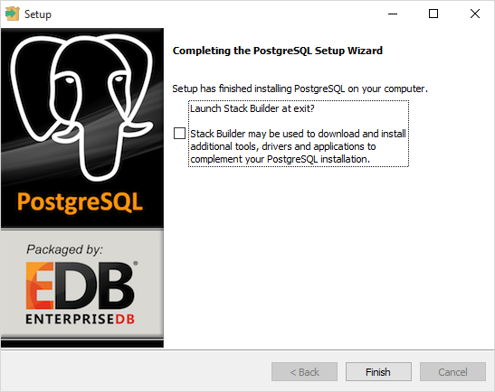
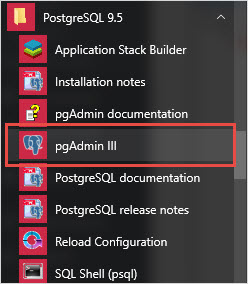
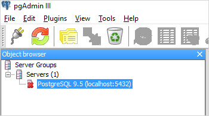
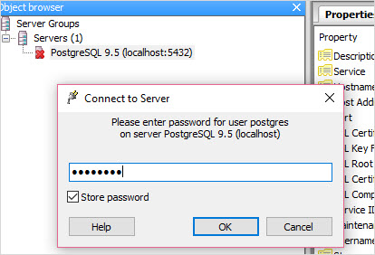
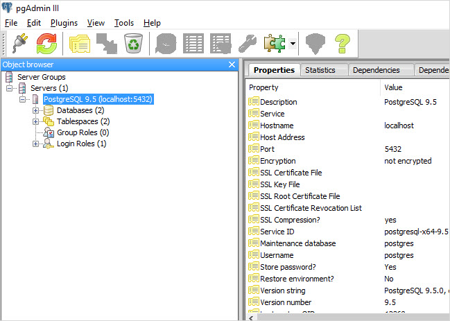

# Instalando o PostgreSQL
Sumário: neste tutorial nós te ensinaremos como instalar o PostgreSQL em seu sistema local para aprendizado e prática.

PostgreSQL foi desenvolvido para plataformas UNIX-like, porêm, foi projetado para ser portável. Isso quer dizer que ele também pode rodar em outras plataformas como MacOS X, Solaris e Windows.

Desde a versão 8.0 o PostgreSQL oferece um instalador para os sistemas Windows para que o processo de instalação seja mais fácil e rápido. Para questões de desenvolvimento, nós instalaremos o PostgreSQL 9.5 no Windows 10.

- NOTA: Se você estiver rodando o Windows 8 ou o 10 você precisa criar usuários Windows com privilégios de administrados, por exemplo "postgres" e usar este usuário para rodar o instalador. Dê uma olhada na seção de solução de problemas aí em baixo para informações mais detalhadas

Existem 3 passos para completar a instalação do PostgreSQL:
- Baixar o instalador para Windows
- Instalar
- Verificar a instalação

# Baixar o instalador para Windows

- Você precisa baixar o instalador do site oficial do PostgreSQL (por favor).
- Vá para o site oficial, seção de download para Windows [aqui](http://www.postgresql.org/download/windows/)
- Clique no baixar instalador do EnterpriseDB
- Escolha a última versão para baixar. Isso vai demorar alguns minutos para baixar (se você for brasileiro vai demorar mais).
 
 # Passo a passo da instalação do PostgreSQL

- Dê dois cliques no instalador, um assistente de instalação aparecerá e o guiará através de alguns passos onde você pode escolher diferentes opções que você gostaria de ter no PostgreSQL (estes instaladores costumam ser bem intuitivos, só prestar atenção para não instalar o baidu).

O seguinte ilustrará cada passo e suas opções para instalação. Se você instaçar uma versão diferente, você pode ter passos adicionais.

- Iniciando instalação do PostgreSQL

- Especifique a pasta de instalação, selecione a sua própria ou deixe a padrão sugeria pelo instalador.

- Coloque a senha de superusuário do banco e uma conta de serviço

- Coloque uma porta de rede para o PostgreSQL. Tenha certeza que nenhum outro programa está usando essa porta para evitar problemas. Deixe a padrão se você não tem certeza.

- Coloque o local padrão usado pelo banco de dados.

- Você completou a entrevista para o instalador do PostgreSQL. Clique no botão "Next" para instalar.

- A instalação pode demorar uns minutos para terminar.

- Clique em finish para finalizar a instalação.

# Verificando a instalação

- Existem alguns jeitos de verificar a instalação. Você pode tentar se conectar com o servidor do PostgreSQl usando qualquer cliente compatível como psql, pgAdmin, etc.
- Um jeito rápido de verificar essa instalação é pelo programa pgAdmin.
- Primeiramente, clique no pgAdmin III para rodá-lo, a janela dele surgirá (talvez com algum atraso).

- Segundamente clique duas vezes no PostgreSQL no navegador de objetos que vai ficar provavelmente na direita. Ele irá pedir pela senha de administrados. Apenas coloque aquela senha que você usou na instalação.

- Terceiramente, se tudo der certo, o pgAdmin vai te mostrar todos os objetos que pertencem ao servidor.

- Parabéns! Você conseguiu instalar o PostgreSQL no seu sistema local. Bora aprender os jeitos de se conectar no servidor recém instalado.

# Solução de Problemas

- Se você receber o seguinte erro enquanto instala o PostgreSQL no Windows (8 ou 10):  ` Failed to load sql modules into the database cluster ` e a mensagem seguinte mostra `Error running post install step. Installation may not complete correctly. Error reading C:/Program Files/PostgreSQL/9.5/postgresql.conf` Você necessita fazer os seguintes passos:
    - Desinstalar o PostgreSQL e exluir a pasta de dados na pasta de instalação.
    - Criar um usuário no Windows chamado `postgres` e adicioná-lo ao grupo dos administradores.
    - Reiniciar o computador
    - Abra o cmd só que com esse usuário postgres, um jeito é usando o comando  `runas /user:postgres cmd.exe` e abra o instalador do postgres por essa janela e tente instalar de novo.